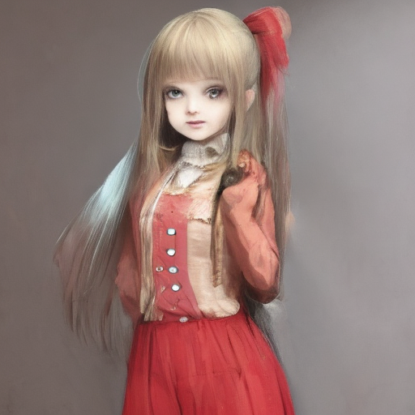
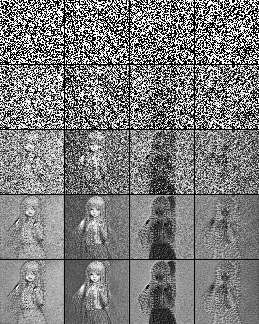
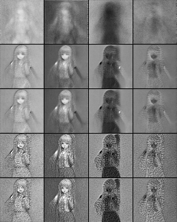
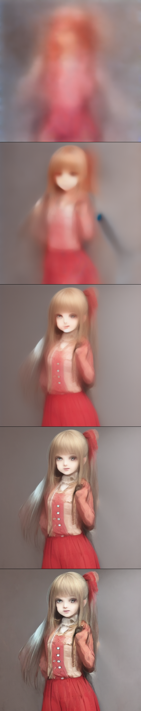

# What's this?

This is an extension for [stable-diffusion-webui](https://github.com/AUTOMATIC1111/stable-diffusion-webui) that adds a custom script, which let you to observe latent vector.

# Examples

- Original generated image:

- U-Net input latent vector ("noisy" image):

- U-Net output latent vector ("denoised" image):

- Output Images which are generated in each steps:

